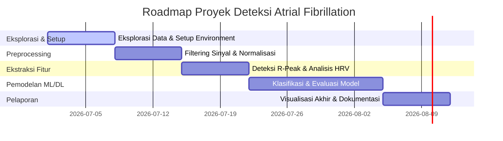

# Laporan Analisis Data & Roadmap Pekerjaan (MIT-BIH AFDB)

Laporan ini disusun untuk memberikan gambaran lengkap mengenai data elektrokardiogram (ECG) yang terdapat di folder `files/`, cara menampilkan data tersebut, serta rencana peta jalan (*roadmap*) pekerjaan untuk mengolah data ini.

---

## 1. Identifikasi Jenis & Bentuk Data

Data yang ada dalam folder `files/` berasal dari **MIT-BIH Atrial Fibrillation Database (AFDB)** yang di-host di PhysioNet. Database ini merupakan kumpulan data klinis yang digunakan untuk mendeteksi penyakit **Atrial Fibrillation (AF)** atau fibrilasi atrium (salah satu jenis aritmia jantung).

### Karakteristik Sinyal
* **Kanal Sinyal**: Setiap rekaman berisi **2 kanal sinyal ECG** (biasanya dinamai `ECG1` dan `ECG2`).
* **Frekuensi Sampling ($f_s$)**: **250 Hz** (artinya ada 250 sampel data per detik).
* **Durasi Rekaman**: Umumnya berdurasi panjang, berkisar hingga **10 jam** per subjek (~9,2 juta sampel per kanal).
* **Resolusi**: Sinyal disimpan dalam format **12-bit** (Format 212 WFDB).

### Struktur File di Folder `files/`
Data disimpan menggunakan format standar **WFDB (Waveform Database)**. Setiap subjek/rekaman diidentifikasi dengan nomor record (misal: `04015`) dan terdiri dari kombinasi file berikut:

| Ekstensi File | Nama Format | Penjelasan |
| :--- | :--- | :--- |
| **`.hea`** | Header File | Menyimpan metadata rekaman (frekuensi sampling, jumlah kanal, nama sinyal, kalibrasi gain ADC, satuan amplitudo) dalam bentuk teks biasa. |
| **`.dat`** | Data File | Menyimpan nilai sinyal ECG mentah (*raw signals*) dalam bentuk biner terkompresi format 212. |
| **`.atr`** | Rhythm Annotations | Anotasi ritme jantung resmi yang dibuat secara manual oleh para ahli medis (menyimpan kapan dimulainya ritme normal `(N`, atrial fibrillation `(AFIB`, atau atrial flutter `(AFL`). |
| **`.qrs`** | Beat Annotations | Anotasi lokasi puncak detak jantung (QRS complex/R-peak) yang dihasilkan secara otomatis oleh algoritma detektor (belum dikoreksi manual). |
| **`.qrsc`** | Corrected Beat Annotations | Anotasi detak jantung yang telah dikoreksi secara manual (hanya tersedia untuk beberapa record seperti `05091`). |

### Catatan Khusus & Ketidaklengkapan Data (Berdasarkan `notes.txt`)
Beberapa record memiliki keterbatasan yang harus diantisipasi saat melakukan preprocessing:
1. **Sinyal Tidak Tersedia**: Record **`00735`** dan **`03665`** hanya memiliki file anotasi (`.atr` & `.qrs`), tetapi **tidak memiliki file sinyal `.dat`**. Kedua record ini tidak bisa digunakan untuk pemodelan sinyal ECG.
2. **Sektor Data Rusak (*Unreadable Blocks*)**:
   * Record **`04043`**: Block 39 rusak/tidak terbaca.
   * Record **`08405`**: Block 1067 rusak/tidak terbaca.
   * Record **`08434`**: Block 648, 857, dan 894 rusak/tidak terbaca.
3. **Tanpa Waktu Mulai (*No Start Time*)**: Record **`08378`**, **`08405`**, dan **`08455`** tidak memiliki koordinat waktu mulai di header file.
4. **Durasi Berbeda**: Record **`06453`** lebih pendek dibanding yang lain, berhenti setelah sekitar 9 jam 15 menit.

---

## 2. Cara Membaca & Menampilkan Data (Visualisasi)

Karena data disimpan dalam format biner WFDB, file `.dat` tidak dapat dibuka langsung menggunakan pembaca file teks atau CSV biasa. Cara termudah adalah menggunakan pustaka python resmi dari PhysioNet yaitu **`wfdb`**.

### Langkah Persiapan Environment
Pasang library Python yang diperlukan melalui terminal:
```bash
pip install wfdb matplotlib numpy pandas scipy
```

### Kode Python untuk Visualisasi Sinyal & Anotasi
Berikut adalah contoh skrip python yang juga telah diintegrasikan ke dalam file [main.ipynb](file:///home/gung/Dokumen/magang/main.ipynb) untuk menampilkan sinyal ECG sepanjang 8 detik pertama beserta deteksi detak jantung (QRS) dan tanda ritme aktif:

```python
import wfdb
import matplotlib.pyplot as plt
import numpy as np

# Path ke record (tanpa menuliskan ekstensi file)
record_path = 'files/04015'

# 1. Membaca record sinyal & metadata
record = wfdb.rdrecord(record_path)

# 2. Membaca anotasi
try:
    beat_ann = wfdb.rdann(record_path, 'qrs')     # Anotasi beat (QRS)
    rhythm_ann = wfdb.rdann(record_path, 'atr')   # Anotasi ritme (AFIB, dll)
except Exception as e:
    print(f"Gagal memuat anotasi: {e}")

# 3. Konfigurasi Plotting
fs = record.fs
seconds_to_plot = 8
n_samples = int(seconds_to_plot * fs)
time_axis = np.arange(n_samples) / fs

plt.figure(figsize=(14, 7))
for channel_idx in range(record.n_sig):
    plt.subplot(record.n_sig, 1, channel_idx + 1)
    
    # Plot sinyal ECG kanal ke-i
    plt.plot(time_axis, record.p_signal[:n_samples, channel_idx], 
             label=f"{record.sig_name[channel_idx]}", color='#1f77b4' if channel_idx == 0 else '#ff7f0e')
    
    # Tandai letak puncak R (QRS)
    if 'beat_ann' in locals():
        in_range = beat_ann.sample < n_samples
        for sample, symbol in zip(beat_ann.sample[in_range], np.array(beat_ann.symbol)[in_range]):
            t_sec = sample / fs
            plt.axvline(x=t_sec, color='red', linestyle='--', alpha=0.5)
            plt.text(t_sec, plt.gca().get_ylim()[1] * 0.85, symbol, color='red', weight='bold', ha='center')
            
    # Tandai perubahan ritme
    if 'rhythm_ann' in locals():
        in_range_rhythm = rhythm_ann.sample < n_samples
        for r_sample, r_note in zip(rhythm_ann.sample[in_range_rhythm], rhythm_ann.aux_note[in_range_rhythm]):
            r_t = r_sample / fs
            plt.axvline(x=r_t, color='purple', linestyle='-', alpha=0.8, linewidth=2)
            plt.text(r_t + 0.05, plt.gca().get_ylim()[0] * 0.7, f"Ritme: {r_note}", 
                     color='purple', weight='bold', bbox=dict(facecolor='white', alpha=0.8))

    plt.ylabel(f"Amplitudo ({record.units[channel_idx]})")
    plt.xlabel("Waktu (detik)")
    plt.grid(True, linestyle=':', alpha=0.6)
    plt.legend(loc='upper right')

plt.suptitle(f"Visualisasi ECG Sinyal & Anotasi - Record {record.record_name}", fontsize=14, weight='bold')
plt.tight_layout()
plt.show()
```

---

## 3. Rencana Peta Jalan (Roadmap) Pekerjaan

Berikut adalah rancangan kasar peta jalan pekerjaan proyek analisis ini dengan target rentang waktu **6 Minggu**:



### Rincian Pekerjaan Mingguan:

#### **Minggu 1: Eksplorasi Awal & Setup Lingkungan**
* **Tujuan**: Memahami distribusi data dan karakteristik masing-masing record subjek.
* **Tugas**:
  1. Instalasi library pendukung (`wfdb`, `numpy`, `scipy`, `matplotlib`, `scikit-learn`).
  2. Membuat script otomatis untuk memindai seluruh record dalam folder `files/`.
  3. Menganalisis statistik dasar: durasi sinyal per record, jumlah kejadian *Atrial Fibrillation* (AFIB) versus ritme normal (N), dan membuang record kosong (`00735`, `03665`).

#### **Minggu 2: Preprocessing Sinyal (Pembersihan Derau)**
* **Tujuan**: Menghilangkan artefak dan noise yang merusak sinyal ECG agar siap diinputkan ke model.
* **Tugas**:
  1. **Baseline Wander Removal**: Menghilangkan pergeseran garis dasar sinyal akibat pernapasan pasien menggunakan filter High-Pass (cut-off ~0.5 Hz) atau metode Median Filtering ganda.
  2. **Powerline Noise Filtering**: Menerapkan Notch Filter pada frekuensi 50 Hz atau 60 Hz untuk mereduksi derau listrik jala-jala.
  3. **High-Frequency Noise Removal**: Menerapkan Low-Pass Filter (cut-off ~40 Hz) untuk mereduksi noise kontraksi otot (EMG).
  4. Melakukan normalisasi sinyal (misalnya Z-score normalization atau Min-Max scaling).

#### **Minggu 3: Deteksi R-Peak & Segmentasi Sinyal**
* **Tujuan**: Menemukan lokasi detak jantung (puncak R) dan membagi sinyal menjadi segmen yang siap dianalisis.
* **Tugas**:
  1. Menerapkan algoritma deteksi puncak R (seperti metode Pan-Tompkins atau mencocokkan dengan anotasi `.qrs`/`.qrsc` bawaan).
  2. Menghitung **RR-Interval** (selisih waktu antar puncak R berturut-turut).
  3. Melakukan segmentasi sinyal (misalnya segmen berdurasi 30 detik atau window geser per 100 detak jantung) untuk diklasifikasikan sebagai AFIB atau Normal berdasarkan data ground truth dari file `.atr`.

#### **Minggu 4 - 5: Rekayasa Fitur & Pemodelan Machine/Deep Learning**
* **Tujuan**: Membangun model cerdas untuk mengklasifikasikan Atrial Fibrillation.
* **Tugas**:
  * **Pendekatan Klasik (Machine Learning)**:
    1. Mengekstrak fitur Heart Rate Variability (HRV) dari RR-interval:
       * *Domain Waktu*: Mean RR, SDNN, RMSSD, pNN50.
       * *Domain Frekuensi*: Low Frequency (LF), High Frequency (HF), rasio LF/HF.
       * *Non-Linear*: Poincaré plot ($SD_1$, $SD_2$), Sample Entropy.
    2. Melatih model klasifikasi seperti Random Forest, Support Vector Machine (SVM), atau XGBoost.
  * **Pendekatan Modern (Deep Learning)**:
    1. Menggunakan 1D Convolutional Neural Network (1D-CNN) or Long Short-Term Memory (LSTM) langsung pada potongan sinyal ECG mentah pasca-filter.
  * **Pencegahan Data Leakage**: Memastikan pembagian data train/test berdasarkan *Patient-Specific* (data pasien yang sama tidak boleh tercampur di set train dan test).

#### **Minggu 6: Evaluasi, Visualisasi Hasil & Pelaporan**
* **Tujuan**: Mengukur kinerja model secara klinis dan menyusun laporan akhir magang.
* **Tugas**:
  1. Mengukur performa menggunakan metrik: Akurasi (*Accuracy*), Sensitivitas/Recall (*Sensitivity*), Spesifisitas (*Specificity*), F1-Score, dan grafik ROC-AUC.
  2. Membuat skrip visualisasi yang mewarnai segmen ECG secara dinamis (misalnya area hijau untuk ritme normal dan area merah saat model mendeteksi adanya Atrial Fibrillation).
  3. Menyusun dokumen laporan akhir magang berisi metodologi, hasil eksperimen, dan analisis performa model.
